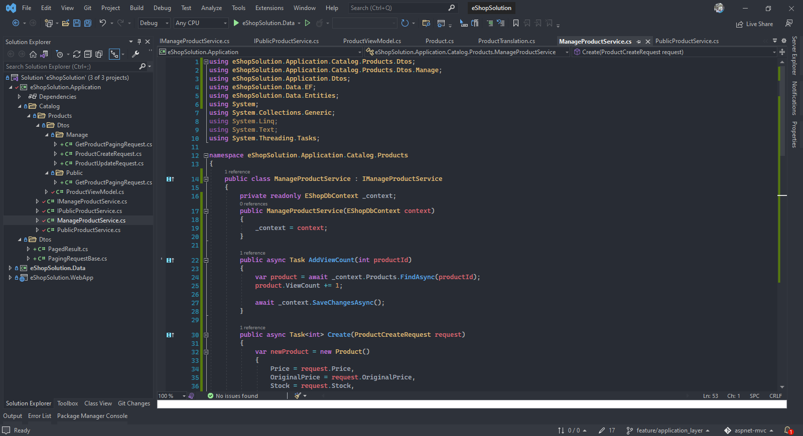

# Khóa học Làm dự án với ASP.NET Core MVC Tedu

## 1. Tổng quan

Course content

- Build a completed application from scratch
- Database design
- Admin page for management
- Frontend page for customer
- Entity framework code first
- Git source control

Technologies

- ASP.NET Core 3.1
- Entity Framework Core 3.1
- SQL Server 2019
- C# 8.0

Required skills

- HTML & CSS
- Javascript basic
- C# basic
- SQL Server basic

## 2. Tạo dự án

Tạo `solution` mới

- Mở visual studio
- Tạo dự án mới
- Tìm kiếm từ khóa `blank`
- Tạo `blank solution`, đặt tên `eShopSolution`


Tạo `project` mới

- Chuột phải lên `solution`
- Chọn `new project`
- Tìm kiếm `ASP.NET Core Web Application (MVC)`
- Đặt tên `project` là `eShopSolution.WebApp`


Cấu trúc thư mục `project`

- Mô hình `MVC`
- `appsettings.json`: chứa các cài đặt cho ứng dụng, có thể tạo nhiều `appsetting` cho các môi trường khác nhau như: `dev`, `prod`, `staging`, ...
- `wwwroot`: chứa các thành phần tĩnh: `css`, `js` hay `image`
- `Program.cs`: `entry point` của ứng dụng
- `Startup.cs`: Chứa các cài đặt, cấu hình, `middleware`,...
- Trong `properties`, `launchSettings.json` chứa các cấu hình chạy server, được định nghĩa tại khóa `profiles`: bao gồm `IIS Express` và tự `host`. Thường sẽ
  chọn tự host


### 2.1. Git flow

- Tạo nhánh mới cho `git`
- `master` --> `develop`
- Phát triển tính năng mới: `feature/create_solution_folder` --> create `pull` request to `develop`
- Fix bug: `bugfix/fix_error_start` --> create `pull` request to `develop`

Tạo nhánh mới `feature/create_solution_folder` để bắt đầu xây dựng các thư mục
tương ứng với cấu trúc `N layer`


### 2.2. Tạo cấu trúc `solution`

Thường viết theo 2 dạng:

- `N layer`: chia 3 tầng `Data`, `Business`, `Presentation`, thiết kế theo hướng dữ liệu `Data Driven Design`
- `DDD`: `Domain driven design`, thiết kế theo hướng nghiệp vụ

Trong trường hợp dự án này ta sẽ dùng mô hình `N layer`

Chọn `solution`, tạo các `project` mới

- Tạo `Class Library (.NET Core)`, đặt tên `eShopSolution.Data` (Data)
- Tạo `Class Library (.NET Core)`, đặt tên `eShopSolution.Application` (Business)


### 2.3. Web Application | Request pipeline

## 3. Thiết kế chức năng hệ thống

Áp dụng mô hình `agile/scrum`

Các loại thiết kế:

- Thiết kế cấu trúc dữ liệu
- Thiết kế `architect`
- Thiết kế giải thuật

Tạo `user stories`

- Customer want to have a good UI design
- Customer want to have a good SEO website
- Customer want to show list products
- Customer want to classify the products (1 product will belong to 1 or multiple categories)
- Customer want to make multiple-levels for prouct categories
- Customer want to sell online on website
- Customer want to easy manage all products
- Customer want to have members
- Customer want to control access from `admin`
- Customer want to intergrate payment online
- Customer want to intergrate login with Google and Facebook
- Customer want to show product detail (unique code, name, description, price, warranty,...)
- Customer want to have promotion? sales?
- Customer want to have multiple-languages
- Customer want to have multiple-images for each product
- Customer want to have contact information

Tạo các `functions` (chức năng) từ `user stories`

- Customer want to have a good UI design

  - Design UI for all pages
  - HTML support SEO (title, heading, alt, description,...)

- Customer want to show list products

  - List products
  - Product details

- Customer want to sell online on website

  - Cart
  - Orders

- Customer want to control access from `admin`

  - Admin page (manage products, categories)

- Customer want to have members

  - Login
  - Register
  - Manage users
  - Permission

- Customer want to intergrate payment online
  - Transaction
  - Payment intergration
- Customer want to intergrate login with Google and Facebook

  - External login intergration

- Customer want to have promotion? sales?

  - Promotion

- Customer want to have multiple-languages
  - Multiple languages

Phân rã chức năng thành 2 phân hệ: `admin page` và `customer page`

Các chức năng thuộc phân hệ `admin`

- Login
- Logout
- Menu
- UI for admin
- Show login information
- Change password for admin
- Manage product
- Manage product categories
- Manage members
- Manage orders
- Manage transactions information
- Manage permission

Các chức năng thuộc phân hệ `customer` (trang `website`)

- UI HTML
- List product categories
- Show product by categories
- Product details
- Cart
- Login
- Register
- Show information
- Change password
- Forgot password
- Logout
- Checkout
- Payment confirmation
- Profile/list orders
- Contact
- Search

### 3.1. Thiết kế CSDL

Chia các bảng vào các nhóm: `system`, `online shopping` và `utilities`

System

- Users
- Roles
- UserRoles
- Permissions
- Actions
- Functions
- Configurations

Online shopping

- Products
- Categories
- ProductCategories
- Carts
- Orders
- OrderDetails
- Transactions
- ProductTranslations
- CategoriesTranslations
- Promotions

Ultilities

- SystemActivities
- Contacts
- Languages

Thiết kế chi tiết

| Users         |
| ------------- |
| Id            |
| UserName      |
| Password      |
| PhoneNumber   |
| Email         |
| DOB           |
| FullName      |
| LastLoginDate |

| Roles       |
| ----------- |
| Id          |
| Name        |
| Description |

| UserRoles |
| --------- |
| UserId    |
| RoleId    |

| Permissions |
| ----------- |
| RoleId      |
| FunctionId  |
| ActionId    |

| Actions |
| ------- |
| Id      |
| Name    |

| Functions |
| --------- |
| Id        |
| Name      |
| Url       |
| ParentId  |
| Status    |
| SortOrder |

| Configurations |
| -------------- |
| Key            |
| Value          |

| Products       |
| -------------- |
| Id             |
| Name           |
| Descriptions   |
| Price          |
| OriginalPrice  |
| Details        |
| Stock          |
| SeoDescription |
| SeoTitle       |
| SeoAlias       |
| ViewCount      |
| DateCreated    |

| Categories     |
| -------------- |
| Id             |
| Name           |
| SortOrder      |
| IsShowOnHome   |
| ParentId       |
| Status         |
| SeoDescription |
| SeoTitle       |
| SeoAlias       |

| Carts     |
| --------- |
| Id        |
| ProductId |
| Quantity  |
| Price     |

| Orders          |
| --------------- |
| Id              |
| OrderDate       |
| UserId          |
| ShipName        |
| ShipAddress     |
| ShipEmail       |
| ShipPhoneNumber |
| Status          |

| OrderDetails |
| ------------ |
| OrderId      |
| ProductId    |
| Quantity     |
| Price        |

| Transactions          |
| --------------------- |
| Id                    |
| TransactionDate       |
| ExternalTransactionId |
| Amount                |
| Fee                   |
| Result                |
| Message               |
| Status                |
| Providers             |

| ProductTranslations |
| ------------------- |
| Id                  |
| ProductId           |
| Name                |
| Description         |
| Details             |
| SeoDescription      |
| SeoTitle            |
| SeoAlias            |
| LanguageId          |

| CategoriesTranslations |
| ---------------------- |
| Id                     |
| CategoryId             |
| Name                   |
| SeoDescription         |
| SeoTitle               |
| SeoAlias               |
| LanguageId             |

| Promotions        |
| ----------------- |
| Id                |
| FromDate          |
| ToDate            |
| ApplyForAll       |
| DiscountPercent   |
| DiscountAmount    |
| ProductIds        |
| ProductCategories |
| Status            |
| Name              |

| SystemActivities |
| ---------------- |
| Id               |
| ActionName       |
| ActionDate       |
| FunctionId       |
| UserId           |
| ClientIP         |

| Contact     |
| ----------- |
| Id          |
| Name        |
| Email       |
| PhoneNumber |
| Message     |
| Status      |

| Languages |
| --------- |
| Id        |
| Name      |
| IsDefault |

### 3.2. Cài đặt Entity Framework

Chọn project `eShopSolution.Data`, chuột phải chọn `Manage Packages with NuGet` và tiến hành cài đặt các thư viện cần thiết

- `dotnet add package Microsoft.EntityFrameworkCore.SqlServer`
- `dotnet add package Microsoft.EntityFrameworkCore.Design`
- `dotnet add package Microsoft.EntityFrameworkCore.Tools`

Tạo 2 thư mục:

- `EF`
- `Entities`

Để cấu hình `entity`

- Dùng `Attribute configuration`: dùng các thuộc tính trên lớp `entity` như `[Table()]` hay `[Required]`
- Dùng `Fluent API configuration` (thường dùng)


### 3.3. Entity Framework

- Là một `ORM`
- Quản lý các `table` thông qua các `proxy`, quản lý `table` thông qua
  các `class` trong `C#`
- Trái tim của `Entity Framework` là lớp `DbContext`, nơi chứa mọi `config`

### 3.4. Cấu hình Entity thông qua `Fluent API`

- Tạo `folder` `Configurations` tại `project` `eShopSolution.Data`
- Tạo `class` cấu hình tương ứng với mỗi `entity`
- `override` phương thức `OnModelCreating` tại lớp `DbContext`

Bên trong folder `Configurations`, ta tiến hành tạo lần lượt các lớp `configuration` tương ứng với các `entity`. Các lớp này cần phải:

- Thực thi `interface` `IEntityTypeConfiguration`
- Tại phương thức `Configure`, ta có thể cấu hình khá nhiều thông tin liên quan
  tới bảng và các trường dữ liệu, cũng như mối quan hệ giữa các `entity`

  - Đặt tên bảng: `builder.ToTable("Orders")`
  - Đặt khóa chính: `builder.HasKey(x => x.Id)`
  - Cấu hình thuộc tính: `builder.Property(x => x.ShipEmail).IsRequired().IsUnicode(false).HasMaxLength(50)`
  - Cấu hình mối quan hệ nhiều - nhiều (cần `class` trung gian): giữa `Category` và `Product` thông qua bảng trung gian `ProductInCategory`
  - Cấu hình mối quan hệ 1 nhiều: giữa `Order` và `OrderDetail`, cấu hình trên lớp `OrderDetail`

Để cấu hình mối quan hệ giữa các `Entity`, bên trong `Entity` cần khai báo các đối tượng tương ứng.

- 1 `Order` có nhiều `OrderDetail`, như vậy bên trong `Order` phải có 1 `List<OrderDetail>`, ngược lại bên trong `OrderDetail` phải có 1 đối tượng `Order`

- ```csharp
    namespace eShopSolution.Data.Entities
    {
      public class Order
        {
            public int Id { set; get; }
            public DateTime OrderDate { set; get; }
            public Guid UserId { set; get; }
            public string ShipName { set; get; }
            public string ShipAddress { set; get; }
            public string ShipEmail { set; get; }
            public string ShipPhoneNumber { set; get; }
            public OrderStatus Status { set; get; }

            public List<OrderDetail> OrderDetails { get; set; }
        }
    }
  ```

- ```csharp
    namespace eShopSolution.Data.Entities
    {
        public class OrderDetail
        {
            public int OrderId { set; get; }
            public int ProductId { set; get; }
            public int Quantity { set; get; }
            public decimal Price { set; get; }

            public Order Order { get; set; }

            public Product Product { get; set; }
        }
    }
  ```

Sau khi cấu hình các `Entity`, ta cần `load` các cấu hình này vào `DbContext` thông qua việc ghi đè phương thức `OnModelCreating`

```csharp
namespace eShopSolution.Data.EF
{
    public class EShopDbContext : DbContext
    {
        public EShopDbContext(DbContextOptions options) : base(options) { }
        protected override void OnModelCreating(ModelBuilder modelBuilder)
        {
            modelBuilder.ApplyConfiguration(new CartConfiguration());

            modelBuilder.ApplyConfiguration(new AppConfigConfiguration());
            modelBuilder.ApplyConfiguration(new ProductConfiguration());
            modelBuilder.ApplyConfiguration(new CategoryConfiguration());
            modelBuilder.ApplyConfiguration(new ProductInCategoryConfiguration());
            modelBuilder.ApplyConfiguration(new OrderConfiguration());

            modelBuilder.ApplyConfiguration(new OrderDetailConfiguration());
            modelBuilder.ApplyConfiguration(new CategoryTranslationConfiguration());
            modelBuilder.ApplyConfiguration(new ContactConfiguration());
            modelBuilder.ApplyConfiguration(new LanguageConfiguration());
            modelBuilder.ApplyConfiguration(new ProductTranslationConfiguration());
            modelBuilder.ApplyConfiguration(new PromotionConfiguration());
            modelBuilder.ApplyConfiguration(new TransactionConfiguration());

            // base.OnModelCreating(modelBuilder);
        }
    }
}
```


### 3.5. Database migration

Cấu hình để tạo migration

Cần phải tạo 1 file `appsettings.json` trong dự án `eShopSolution.Data` để lưu trữ các thông tin cấu hình, bao gồm: `ConnectionString`

```json
{
  "ConnectionStrings": {
    "eShopSolutionDb": "Server=.;Database=eShopSolution;Trusted_Connection=True;"
  }
}
```

Tạo `DbContextFactory`

- Tạo `class` `EShopDbContextFactory` bên trong thư mục `EF`

```csharp
namespace eShopSolution.Data.EF
{
    public class EShopDbContextFactory : IDesignTimeDbContextFactory<EShopDbContext>
    {
        public EShopDbContext CreateDbContext(string[] args)
        {
            var optionsBuilder = new DbContextOptionsBuilder<EShopDbContext>();
            optionsBuilder.UseSqlServer("");

            return new EShopDbContext(optionsBuilder.Options);
        }
    }
}
```

Để lấy được `ConnectionStrings` từ tập tin `appsettings.json`, ta cần cài thư viện thông qua `NuGet`

- `FileExtensions`: để gọi phương thức `SetBasePath`
- `Microsoft.Extensions.Configuration.Json`: để gọi phương thức `AddJsonFile`

```csharp
namespace eShopSolution.Data.EF
{
    public class EShopDbContextFactory : IDesignTimeDbContextFactory<EShopDbContext>
    {
        public EShopDbContext CreateDbContext(string[] args)
        {
            IConfigurationRoot configuration = new ConfigurationBuilder()
                .SetBasePath(Directory.GetCurrentDirectory())
                .AddJsonFile("appsettings.json")
                .Build();

            var connectionString = configuration.GetConnectionString("eShopSolutionDb");

            var optionsBuilder = new DbContextOptionsBuilder<EShopDbContext>();
            optionsBuilder.UseSqlServer(connectionString);

            return new EShopDbContext(optionsBuilder.Options);
        }
    }
}
```

Sau đó, chọn phải chọn `project` `eShopSolution.Data` chọn `Setup as startup project`

- Vào `Menu` `Tools`
- Chọn `Manage Package`
- Chọn `Console`
- Chọn `project` `eShopSolution.Data` tại `dropdown`
- Gõ lệnh `Add-Migration Initial` và nhấn `Enter` (cần phải cài đặt thư viện: `Microsoft.EntityFrameworkCore.Tools`)


- Chạy lệnh `update-database` để tạo CSDL từ các tập tin `migrations`


### 3.6. Database seeding

Tạo 1 lượng dữ liệu mẫu sau khi `migration`

Có thể viết các dữ liệu mẫu trực tiếp vào phương thức `OnModelCreating`, tuy nhiên như vậy khá là dài

```csharp
protected override void OnModelCreating(ModelBuilder modelBuilder)
{
    // Configure using Fluent API
    modelBuilder.ApplyConfiguration(new CartConfiguration());

    modelBuilder.ApplyConfiguration(new AppConfigConfiguration());
    modelBuilder.ApplyConfiguration(new ProductConfiguration());
    modelBuilder.ApplyConfiguration(new CategoryConfiguration());
    modelBuilder.ApplyConfiguration(new ProductInCategoryConfiguration());
    modelBuilder.ApplyConfiguration(new OrderConfiguration());

    modelBuilder.ApplyConfiguration(new OrderDetailConfiguration());
    modelBuilder.ApplyConfiguration(new CategoryTranslationConfiguration());
    modelBuilder.ApplyConfiguration(new ContactConfiguration());
    modelBuilder.ApplyConfiguration(new LanguageConfiguration());
    modelBuilder.ApplyConfiguration(new ProductTranslationConfiguration());
    modelBuilder.ApplyConfiguration(new PromotionConfiguration());
    modelBuilder.ApplyConfiguration(new TransactionConfiguration());

    // Database seeding
    modelBuilder.Entity<AppConfig>().HasData(
        new AppConfig() { Key = "HomeTitle", Value = "This is home page of eShopSolution"},
        new AppConfig() { Key = "HomeKeyword", Value = "This is keyword of eShopSolution"},
        new AppConfig() { Key = "HomeDescription", Value = "This is description of eShopSolution"}
    );

    // base.OnModelCreating(modelBuilder);
}
```

Có một cách khác, sử dụng `Extension Method`

- Tạo `folder` `Extensions` trong dự án `eShopSolution.Data`
- Tạo `class` `ModelBuilderExtensions` trong thư mục này
- Tạo phương thức mở rộng và thêm các dòng dữ liệu mẫu

```csharp
namespace eShopSolution.Data.Extensions
{
    public static class ModelBuilderExtensions
    {
        public static void Seed(this ModelBuilder modelBuilder)
        {
            modelBuilder.Entity<AppConfig>().HasData(
                new AppConfig() { Key = "HomeTitle", Value = "This is home page of eShopSolution"},
                new AppConfig() { Key = "HomeKeyword", Value = "This is keyword of eShopSolution"},
                new AppConfig() { Key = "HomeDescription", Value = "This is description of eShopSolution"}
            );
        }
    }
}
```

Sau khi khai báo phương thức mở rộng, ta có thể gọi phương thức này như dưới đây

```csharp
protected override void OnModelCreating(ModelBuilder modelBuilder)
{
    // Configure using Fluent API
    modelBuilder.ApplyConfiguration(new CartConfiguration());

    modelBuilder.ApplyConfiguration(new AppConfigConfiguration());
    modelBuilder.ApplyConfiguration(new ProductConfiguration());
    modelBuilder.ApplyConfiguration(new CategoryConfiguration());
    modelBuilder.ApplyConfiguration(new ProductInCategoryConfiguration());
    modelBuilder.ApplyConfiguration(new OrderConfiguration());

    modelBuilder.ApplyConfiguration(new OrderDetailConfiguration());
    modelBuilder.ApplyConfiguration(new CategoryTranslationConfiguration());
    modelBuilder.ApplyConfiguration(new ContactConfiguration());
    modelBuilder.ApplyConfiguration(new LanguageConfiguration());
    modelBuilder.ApplyConfiguration(new ProductTranslationConfiguration());
    modelBuilder.ApplyConfiguration(new PromotionConfiguration());
    modelBuilder.ApplyConfiguration(new TransactionConfiguration());

    // Database seeding
    modelBuilder.Seed();

    // base.OnModelCreating(modelBuilder);
}
```

- Tiến hành tạo `migration` mới: `Add-Migration SeedData`
- Cập nhật `dabase` thông qua `Update-Database`


### 3.7. Setup Identity

Cấu hình `Entity Identity` để tạo ra các bảng liên quan đến chứng thực và phân quyền người dùng

- Chọn `project` `eShopSolution.Data`
- Cần phải cài gói: `Identity.EntityFrameworkCore`
- Chỉnh sửa `class` `EShopDbContext` kế thừa từ `IdentityDbContext`

Ta cần tạo ra các lớp liên quan, bao gồm:

- `AppUser`: kế thừa `IdentityUser<Guid>`, với `Guid` là khóa chính của lớp này (`table` này)
- `AppRole`: kế thừa `IdentityRole<Guid>`, với `Guid` là khóa chính của lớp này (`table` này)

```csharp
namespace eShopSolution.Data.Entities
{
    public class AppUser : IdentityUser<Guid>
    {
        public string FirstName { get; set; }
        public string LastName { get; set; }
        public DateTime Dob { get; set; }
    }
}
```

```csharp
namespace eShopSolution.Data.Entities
{
    public class AppRole : IdentityRole<Guid>
    {
        public string Description { get; set; }
    }
}
```

Tạo cấu hình tương ứng cho 2 `entity` `AppUser` và `AppRole` thông qua `Fluent API`

- `AppUserConfiguration`
- `AppRoleConfiguration`

Sau đó, chỉnh sửa `class` kế thừa của `EShopDbContext`

```csharp
namespace eShopSolution.Data.EF
{
    public class EShopDbContext : IdentityDbContext<AppUser, AppRole, Guid>
    {
        public EShopDbContext(DbContextOptions options) : base(options)
        {
        }

        protected override void OnModelCreating(ModelBuilder modelBuilder)
        {
            // Configure using Fluent API
            modelBuilder.ApplyConfiguration(new CartConfiguration());

            modelBuilder.ApplyConfiguration(new AppConfigConfiguration());
            modelBuilder.ApplyConfiguration(new ProductConfiguration());
            modelBuilder.ApplyConfiguration(new CategoryConfiguration());
            modelBuilder.ApplyConfiguration(new ProductInCategoryConfiguration());
            modelBuilder.ApplyConfiguration(new OrderConfiguration());

            modelBuilder.ApplyConfiguration(new OrderDetailConfiguration());
            modelBuilder.ApplyConfiguration(new CategoryTranslationConfiguration());
            modelBuilder.ApplyConfiguration(new ContactConfiguration());
            modelBuilder.ApplyConfiguration(new LanguageConfiguration());
            modelBuilder.ApplyConfiguration(new ProductTranslationConfiguration());
            modelBuilder.ApplyConfiguration(new PromotionConfiguration());
            modelBuilder.ApplyConfiguration(new TransactionConfiguration());

            // Configure for Identity
            modelBuilder.ApplyConfiguration(new AppUserConfiguration());
            modelBuilder.ApplyConfiguration(new AppRoleConfiguration());

            modelBuilder.Entity<IdentityUserClaim<Guid>>().ToTable("AppUserClaims");
            modelBuilder.Entity<IdentityUserRole<Guid>>().ToTable("AppUserRoles").HasKey(x => new { x.UserId, x.RoleId });
            modelBuilder.Entity<IdentityUserLogin<Guid>>().ToTable("AppUserLogins").HasKey(x => x.UserId);
            modelBuilder.Entity<IdentityRoleClaim<Guid>>().ToTable("AppRoleClaims");
            modelBuilder.Entity<IdentityUserToken<Guid>>().ToTable("AppUserTokens").HasKey(x => x.UserId);

            // Database seeding
            modelBuilder.Seed();

            // base.OnModelCreating(modelBuilder);
        }
    }
}
```

Cập nhật mối quan hệ tại các `entity` có liên quan đến `AppUser`, bao gồm:

- `Cart`
- `Order`
- `Transaction`

Cấu hình `Fluent API` tương ứng cho các `entity`, bao gồm:

- `CartConfiguration`
- `OrderConfiguration`
- `TransactionConfiguration`

Chạy `migration`: `Add-Migration AspNetCoreIdentityDatabase`

Cập nhật `database`: `Update-Database`

Tạo dữ liệu mẫu cho các `entity` vừa được thêm vào tại tập tin `ModelBuilderExtensions.cs`

Tiếp tục `migration`: `Add-Migration SeedIdentityUser`

Tiếp tục cập nhật: `Update-Database`


## 4. Tầng `application`

Làm việc tại `project` `eShopSolution.Application`

Chia theo các `module`, thường 1 dự án sẽ có các `module` như `system`, `catalog` (quản lý sản phẩm),...

- `Catalog`: làm việc với `product` và `product_category`.
- `Catalog` gồm 2 phần:
  - `Interface`: Tất cả phương thức của 1 `class` đều định nghĩa thông qua `interface`, làm bản đồ
    để các `class` `implement` cái `interface` này.
  - Áp dụng `DI` (`Dependency Injection`)
  - Tìm hiểu về `SOLID`

Nên chia thành 2 `interface`:

- `IManageProductService`: dành cho phần `admin`
- `IPublicProductService`: dành cho phần `customer`

`ProductViewModel`: thường lấy ra các thuộc tính mà chúng ta muốn hiển thị lên

Tạo `folder` `eShopSolution.Application` `Dtos` để chứa các `DTO` thông dụng, được
dùng lại nhiều lần, ví dụ như `DTO` xác định cấu trúc `response`. Cò được gọi
là `Common DTOs`

Trường hợp dưới đây tạo 1 `common dto` đặt tên `PagedViewModel`, `dto` này có nhiệm
vụ lưu trữ số lượng `record` lấy ra và danh sách các phần tử thuộc kiểu bất kì (kiểu `T`, `generic type`).
Phương thức `GetAll` sẽ trả về đối tượng thuộc kiểu này.

```csharp
namespace eShopSolution.Application.Dtos
{
    public class PagedViewModel<T>
    {
        public int TotalRecord { get; set; }
        List<T> Items { get; set; }
    }
}
```

Để truy cập đến đối tượng `DbContext` tại tầng `Data`, ta cần thêm `reference` từ tầng `Application` đến
tầng `Data`

- Chọn tầng `Application`
- Chuột phải lên `Dependencies`
- `Add Project Reference`
- Click chọn `eShopSolution.Data`

Tại phương thức `Create`, ta có thể thêm 1 `product` vào cơ sở dữ liệu 1 cách nhanh chóng như dưới đây

```csharp
namespace eShopSolution.Application.Catalog.Products
{
    public class ManageProductService : IManageProductService
    {
        private readonly EShopDbContext _context;
        public ManageProductService(EShopDbContext context)
        {
            _context = context;
        }

        public int Create(ProductCreateRequest product)
        {
            var newProduct = new Product();

            _context.Products.Add(newProduct);
            _context.SaveChanges();

            return newProduct.Id;
        }
    }
}
```

Để nhanh và hiệu quả hơn, ta có thể sử dụng phương thức `SaveChangesAsync` thay vì `SaveChanges`. Để
chuyển hướng sang dạng `asynchronous`, ta cần phải làm 1 số công việc thay đổi sau

- Chuyển kết quả trả về từ `int` thành `Task<int>`

  ```csharp
  namespace eShopSolution.Application.Catalog.Products
  {
      public interface IManageProductService
      {
          Task<int> Create(ProductCreateRequest product);

          Task<int> Update(ProductUpdateRequest product);

          Task<int> Delete(int id);

          Task<PagedViewModel<ProductViewModel>> GetAll();

          Task<PagedViewModel<ProductViewModel>> GetAllPaging(string keyword, int pageIndex, int pageSize);
      }
  }
  ```

- Chuyển thành phương thức `async`

  ```csharp
  public async Task<int> Create(ProductCreateRequest product)
  {
      var newProduct = new Product()
      {
          Price = product.Price,
      };

      _context.Products.Add(newProduct);
      return await _context.SaveChangesAsync();
  }
  ```

Dưới đây là cấu trúc ban đầu của tầng `application`, trong đó:

- `module` `Catalog` chứa `folder` `Products`
- Tại `Products` chứa:

  - `Dtos`: các `dto` cần thiết, bao gồm: `CreateRequest` (Create), `UpdateRequest` (Update) và `ProductViewModel` (Read)
  - 2 `interface`, 1 `interface` cho các thao tác quản lý và 1 `interface` cho phân hệ `customer`
  - 2 `class` tương ứng với 2 `interface`

- `folder` `Dtos` ngoài cùng còn được gọi là `Common Dtos`, chứa các `dto` dùng chung cho
  tất cả `module`


### 4.1. Tạo phương thức `search` và phân trang

Tất cả phương thức `paging` đều yêu cầu có 2 tham số `pageIndex` và `pageSize`, do đó
ta nên đưa 2 tham số này vào 1 `class` chung để dễ quản lý

```csharp
namespace eShopSolution.Application.Dtos
{
    public class PagingRequestBase
    {
        public int PageIndex { get; set; }
        public int PageSize { get; set; }
    }
}
```

Sau đó, ta có thể tạo 1 class trừu tượng các yêu cầu trong việc phân trang cho `products` như sau:

```csharp
namespace eShopSolution.Application.Catalog.Products.Dtos
{
    public class GetProductPagingRequest : PagingRequestBase
    {
        public string Keyword { get; set; }
        public List<int> CategoryIds { get; set; }
    }
}
```

Tiếp theo, tại phương thức `GetAllPaging`, ta sẽ sửa thành:

```csharp
namespace eShopSolution.Application.Catalog.Products
{
    public interface IManageProductService
    {
        Task<int> Create(ProductCreateRequest product);

        Task<int> Update(ProductUpdateRequest product);

        Task<int> Delete(int id);

        Task<PagedResult<ProductViewModel>> GetAll();

        Task<PagedResult<ProductViewModel>> GetAllPaging(GetProductPagingRequest request);
    }
}
```

Lúc này, cho dù có thêm bao nhiêu tham số vào `GetProductPagingRequest` thì phương thức `GetAllPaging` cũng không bị thay đổi,
do tất cả tham số đều đã được đóng gói vào `GetProductPagingRequest`

Về phần `ProductUpdateRequest`, ta có thể tách `Id` thành 1 tham số riêng hoặc đóng gói vào `ProductUpdateRequest` cũng
được.

- Không nên `update` tất cả cùng 1 lúc.
- Nên tách riêng việc `update` `Price`
- Nên tách riêng việc `update` `Stock`
- Thường `update` những thông tin tổng quan ở trong `ProductTranslation` thôi

```csharp
namespace eShopSolution.Application.Catalog.Products.Dtos
{
    public class ProductUpdateRequest
    {
        public int Id { get; set; }

        public string Name { set; get; }
        public string Description { set; get; }
        public string Details { set; get; }
        public string SeoDescription { set; get; }
        public string SeoTitle { set; get; }

        public string SeoAlias { get; set; }
        public string LanguageId { set; get; }
    }
}
```

Về phần `ProductCreateRequest`,

```csharp
namespace eShopSolution.Application.Catalog.Products.Dtos
{
    public class ProductCreateRequest
    {
        public decimal Price { get; set; }
        public decimal OriginalPrice { set; get; }
        public int Stock { set; get; }

        public string Name { set; get; }
        public string Description { set; get; }
        public string Details { set; get; }
        public string SeoDescription { set; get; }
        public string SeoTitle { set; get; }

        public string SeoAlias { get; set; }
        public string LanguageId { set; get; }
    }
}
```

Phần `update` chỉ nên `update` các thông tin mô tả, các thông tin khác liên quan
đến `price`, `stock` hay `viewcount` thì nên tách thành các phương thức riêng

```csharp
namespace eShopSolution.Application.Catalog.Products
{
    public interface IManageProductService
    {
        Task<int> Create(ProductCreateRequest product);

        Task<int> Update(ProductUpdateRequest product);

        Task<bool> UpdatePrice(int productId, int newPrice);
        Task<bool> UpdateStock(int productId, int addedQuantity);
        Task AddViewCount(int productId);

        Task<int> Delete(int id);

        Task<PagedResult<ProductViewModel>> GetAll();

        Task<PagedResult<ProductViewModel>> GetAllPaging(GetProductPagingRequest request);
    }
}
```

Lúc này, số lượng `Dto` đã khá nhiều bên trong `module` `products`, ta nên tạo
`folder` để chứa `dto` tương ứng cho 2 phân hệ:

- `Dtos/Manage`: chứa `dto` thuộc phần `admin`
- `Dtos/Public`: chứa `dto` thuộc phần `customer`

Tiến hành di chuyển các `dto` có sẵn vào thư mục `Manage` rồi sau đó thay đổi lại `namespace` cho các `dto` này



Sau đó, ta tiến hành hoàn thiện các phương thức tại `ManageProductService`

### 4.2. `custom exception`

Để dễ dàng phân biệt và xử lý lỗi giữa các `exception`, ta có thể tạo 1 `custom exception`.

- Tạo `project` mới, đặt tên `eShopSolution.Utilities`
- Tạo `folder` mới, đặt tên `Exceptions`
- Tạo `exception` mới, đặt tên `EShopException`

## 5. Quản lý hình ảnh cho sản phẩm

Có nhiều phong cách:

- Tạo 1 trường `xml` hoặc `json` để chứa danh sách ảnh vào bảng `product`
- Tạo 1 bảng riêng (ưu tiên, tận dụng `sql query` để tối ưu tốc độ)

### 5.1. Tạo `entity` mới

```csharp
namespace eShopSolution.Data.Entities
{
    public class ProductImage
    {
        public int Id { get; set; }
        public int ProductId { get; set; }
        public string ImagePath { get; set; }
        public string Caption { get; set; }
        public bool IsDefault { get; set; }
        public DateTime DateCreated { get; set; }
        public int SortOrder { get; set; }
        public int FileSize { get; set; }

        public Product Product { get; set; }
    }
}
```

### 5.2. Cấu hình `entity` sử dụng `Fluent API`

```csharp
namespace eShopSolution.Data.Configurations
{
    public class ProductImageConfiguration : IEntityTypeConfiguration<ProductImage>
    {
        public void Configure(EntityTypeBuilder<ProductImage> builder)
        {
            builder.ToTable("ProductImages");

            builder.HasKey(x => x.Id);
            builder.Property(x => x.Id).UseIdentityColumn();

            builder.Property(x => x.ImagePath).HasMaxLength(200).IsRequired();
            builder.Property(x => x.Caption).HasMaxLength(200);

            builder
                .HasOne(x => x.Product)
                .WithMany(x => x.ProductImages)
                .HasForeignKey(x => x.ProductId);
        }
    }
}
```

### 5.3. Cập nhật `EShopDbContext`

```csharp
namespace eShopSolution.Data.EF
{
    public class EShopDbContext : IdentityDbContext<AppUser, AppRole, Guid>
    {
        public EShopDbContext(DbContextOptions options) : base(options) { }

        protected override void OnModelCreating(ModelBuilder modelBuilder)
        {
            // Product Image
            modelBuilder.ApplyConfiguration(new ProductImageConfiguration());
        }

        public DbSet<ProductImage> ProductImages { get; set; }
    }
}
```

### 5.4. Tiến hành `migrate`

- Chọn `project` `eShopSolution.Data`, đặt `Startup Project`
- Mở cửa sổ `Package Manage Console`
- Chọn `project` `eShopSolution.Data`
- Chạy lệnh `Add-Migration AddProductImageTable`
- Chạy lệnh `Update-Database`

### 5.5. Tách lớp `dto`

Bởi vì tầng `application` và tầng `web mvc` đều sử dụng chung `dto`, do đó
cách tốt nhất là tách `dto` ra 1 `project` riêng.

- Tạo `project` mới
- Đặt tên `eShopSolution.ViewModels`

Di chuyển các `dto` cần thiết vào `project` `ViewModels`

Sau khi chuyển xong, tiến hành cập nhật lại `namespace` và thêm `project reference` tại
`project` `Application`


### 5.6. Tạo các phương thức quản lý ảnh

Có thể làm theo 2 dạng:

- Tạo `product` trước, sau đó cập nhật `product_image` sau
- Đưa `product_image` vào `product_request` và tạo đồng thời

Cần thêm 1 trường `IFormFile` vào `dto` `ProductCreateRequest` để tiếp nhận
ảnh gửi lên từ `client`.

```csharp
namespace eShopSolution.ViewModels.Catalog.Products.Manage
{
    public class ProductCreateRequest
    {
        public decimal Price { get; set; }
        public decimal OriginalPrice { set; get; }
        public int Stock { set; get; }

        public string Name { set; get; }
        public string Description { set; get; }
        public string Details { set; get; }
        public string SeoDescription { set; get; }
        public string SeoTitle { set; get; }

        public string SeoAlias { get; set; }
        public string LanguageId { set; get; }

        public IFormFile ThumbnailImage { get; set; }
    }
}
```

Đồng thời thêm vào `dto` `ProductUpdateRequest`

```csharp
namespace eShopSolution.ViewModels.Catalog.Products.Manage
{
    public class ProductUpdateRequest
    {
        public int Id { get; set; }

        public string Name { set; get; }
        public string Description { set; get; }
        public string Details { set; get; }
        public string SeoDescription { set; get; }
        public string SeoTitle { set; get; }

        public string SeoAlias { get; set; }
        public string LanguageId { set; get; }

        public IFormFile ThumbnailImage { get; set; }
    }
}
```

#### 5.6.1. Lưu trữ hình ảnh

Tạo `interface` và `class` chịu trách nhiệm cho việc lưu trữ hình ảnh

```csharp
namespace eShopSolution.Application.Common
{
    public class FileStorageService : IStorageService
    {
        private readonly string _userContentFolder;
        private const string USER_CONTENT_FOLDER_NAME = "user-content";

        public FileStorageService(IWebHostEnvironment webHostEnvironment)
        {
            _userContentFolder = Path.Combine(webHostEnvironment.WebRootPath, USER_CONTENT_FOLDER_NAME);
        }

        public async Task DeleteFileAsync(string fileName)
        {
            var filePath = Path.Combine(_userContentFolder, fileName);
            if (File.Exists(filePath))
            {
                await Task.Run(() => File.Delete(filePath));
            }
        }

        public string GetFileUrl(string fileName)
        {
            return $"/{USER_CONTENT_FOLDER_NAME}/{fileName}";
        }

        public async Task SaveFileAsync(Stream mediaBinaryStream, string fileName)
        {
            var filePath = Path.Combine(_userContentFolder, fileName);

            using var output = new FileStream(filePath, FileMode.Create);
            await mediaBinaryStream.CopyToAsync(output);
        }
    }
}
```

Về phần `interface` `IWebHostEnvironment`, ta cần phải chỉnh sửa lại `file` `project` `Application`
và thêm dòng `FrameworkReference`

```xml
<Project Sdk="Microsoft.NET.Sdk">

  <PropertyGroup>
    <TargetFramework>net5.0</TargetFramework>
  </PropertyGroup>

  <ItemGroup>
    <FrameworkReference Include="Microsoft.AspNetCore.App" />
  </ItemGroup>

  <ItemGroup>
    <ProjectReference Include="..\eShopSolution.Data\eShopSolution.Data.csproj" />
    <ProjectReference Include="..\eShopSolution.Utilities\eShopSolution.Utilities.csproj" />
    <ProjectReference Include="..\eShopSolution.ViewModels\eShopSolution.ViewModels.csproj" />
  </ItemGroup>

</Project>
```

## 6. Lưu ý về tầng `Application` và `MVC`

Dự án này được phân chia theo kiến trúc `N-layer`, trong đó có các tầng như:
`Data`, `Application`, `WebApp`

`project` `WebApp` lại tiếp tục được phân chia theo kiến trúc `MVC`

Do đó, phần `Controller` sẽ gần giống như là tầng `Application` vậy, có thể đưa
`code` từ tầng `Application` vào đây. Tuy nhiên, tác giả muốn tách riêng `logic`
ra tầng `Application` để dễ quản lý.

Mặt khác, các `dto` được dùng chung ở cả tầng `Application` và tầng `WebApp MVC`.
Do đó, tác giả đã tách các `dto` này ra 1 `project` riêng và đặt tên `ViewModels`.

Ở tầng `Application` chỉ chứa các `Service`
